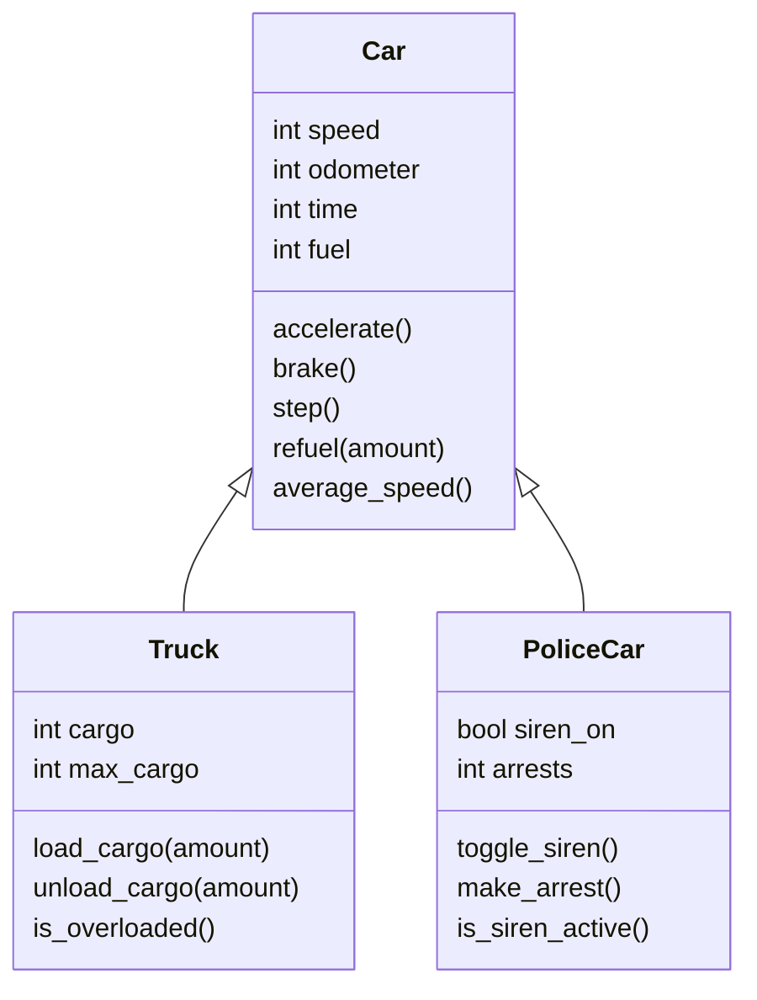

# Unittests_PyCharm


---

## Table of Contents

- [Project Overview](#project-overview)
- [Features](#features)
- [Class Diagram](#class-diagram)
- [Project Structure](#project-structure)
- [How to Run](#how-to-run)
- [Testing & Coverage](#testing--coverage)
- [Requirements](#requirements)
- [License](#license)

---

## Project Overview

This project demonstrates object-oriented programming in Python, focusing on inheritance, encapsulation, and unit testing.  
It features a base `Car` class and two specialized subclasses: `Truck` and `PoliceCar`, each with unique functionalities.  
Comprehensive unit tests are provided using Python's `unittest` framework.

---

## Features

- **Car:**  
  - Acceleration, braking, odometer, fuel management, average speed calculation.

- **Truck:**  
  - Cargo loading/unloading, overload detection.

- **PoliceCar:**  
  - Siren control, arrest tracking.

---

## Class Diagram



---

## Project Structure

```
Unittests_PyCharm/
├── car.py         # Main class implementations
├── test_car.py    # Unit tests
├── README.md      # Project documentation
```

---

## How to Run

1. **Clone the repository:**
   ```
   git clone https://github.com/Niewiaro/Unittests_PyCharm.git
   cd Unittests_PyCharm
   ```

2. **Run the application:**
   ```
   python car.py
   ```

3. **Run the tests:**
   ```
   python -m unittest test_car.py
   ```

---

## Testing & Coverage

- Unit tests are written using Python's `unittest` framework.
- Test classes are organized for clarity and maintainability.
- **Test coverage:**  
    
  _Tests cover 69% of all lines in the project._

---

## Requirements

- Python 3.7 or newer
- No external dependencies

---

## License

This project is for educational purposes only.

---
